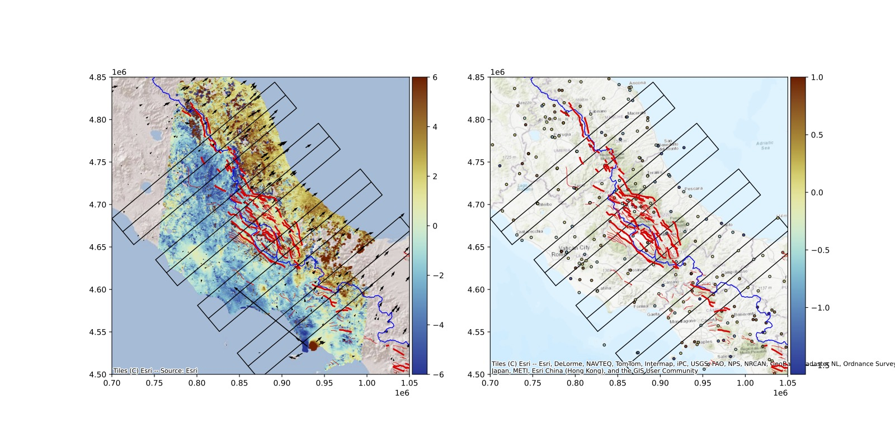
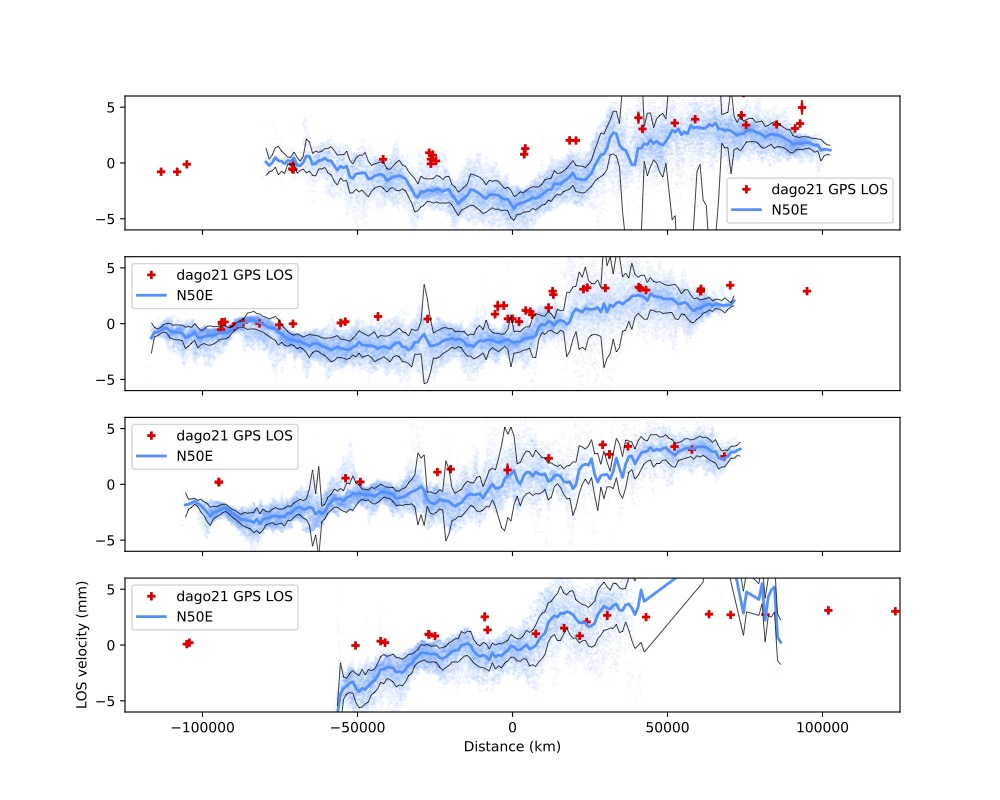
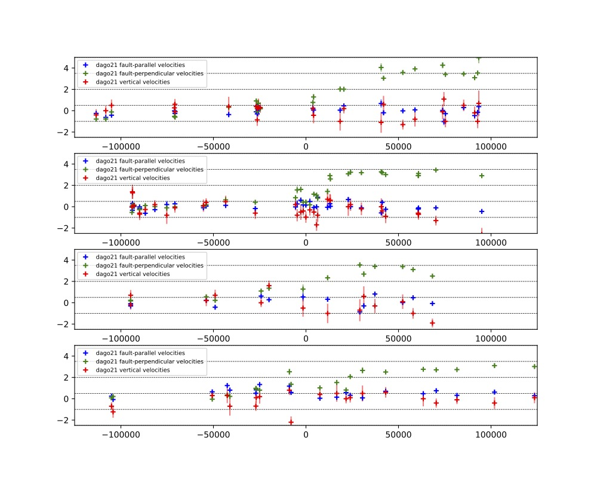
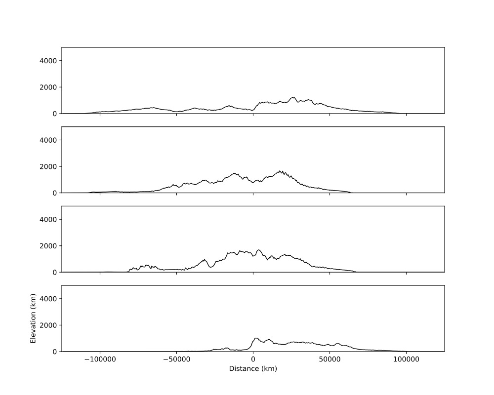
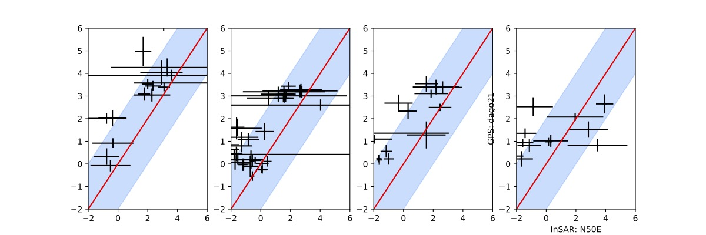
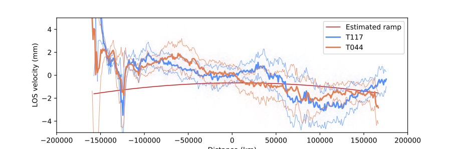

# plotPro.py 

Python script to plot profiles across InSAR and GPS data and/or estimate residual ramps. 

Example of INPUT PYTHON FILE:
============

	# Input Parameters
	maindir='../' # root directory 
	outdir=maindir+'output/profiles/norcia-vertical/' # output directory to save files
	xmin, xmax = 7.8e2, 9.1e2 # x/east map extents in km
	ymin, ymax = 4.7e3, 4.8e3 # y/north map extents in km
	plot_basemap = True # plot basemap 
	export_profile = True # If True, export profile in text file

	import matplotlib.cm as cm
	cmap = cm.rainbow # define colormap (Optional)

	insardata=[
        network(network='N50E_mmyr.xylos',reduction='T022',wdir=maindir+'/decomposition/8looks/',dim=1,scale=1,utm_proj='32632',color='dodgerblue',lmin=-8,lmax=8),
	]

	# Optional
	gpsdata=[
        network(network='stations_dago.txt',reduction='dago21',wdir=maindir+'gps/',dim=3,scale=1,utm_proj='32632',lmin=-2.5,lmax=5,proj=[0.766044443118978,0.6427876096865394,0]),
	]
	
	profiles=[
         profile(name='Viso',x=8.44e2,y=4.76e3,l=100,w=10,strike=-40,type='stdscat',lbins=1.),
         profile(name='Norcia',x=8.47e2,y=4.75e3,l=100,w=10,strike=-40,type='stdscat',lbins=1.),
         profile(name='Amatrice',x=8.5e2,y=4.74e3,l=100,w=10,strike=-40,type='stdscat',lbins=1.),
        ]

	# Optional
	shapefiles=[
        shapefile(name='Regions',wdir=maindir+'italian-maps-shapefiles/italy-with-regions/',filename='reg2011_g.shp',utm_proj='32632',edgecolor='black',color='none',linewidth=0.5),
        shapefile(name='Main faults',wdir=maindir+'faults/',filename='fault_main_utm32.shp',utm_proj='32632',edgecolor='none',color='red'),
        shapefile(name='Secondary faults',wdir=maindir+'faults/',filename='fault_utm32.shp',utm_proj='32632',edgecolor='none',color='red',linewidth=0.5)
        ]

	# Optional
	topodata=[
        topo(name='DEM_20',wdir=maindir+'DEM_ITALY_20/',filename='DEM20_11.5_15_41.5_43.5_s360.xyz',color='black',width=1.,utm_proj='32632',scale=1,topomin=0, topomax=5000),
        ]

	# Optional
	seismifiles=[
        seismicity(name='INGV 2014-2021', wdir=maindir+'seismicity/',filename='ingv_2014-2021.txt',color='yellow',width=2.,utm_proj='32632',fmt='txt')
	]

	# Optional
	fmodel=[
		fault2d(name='LF',x=8.394e2,y=4.6806e3,utm_proj=None), # add 2D fault in map view
	]

Examples of Output Figures:
============

Example of INPUT PYTHON FILE able to stitch two InSAR tracks together in the overlap avera:
============
	
	maindir='../'
	outdir=maindir+'output/profiles/flatten/'
	xmin, xmax = 0.6e3, 1.1e3
	ymin, ymax = 4.5e3, 4.9e3

	insardata=[
        network(network='T117_inter_LOSVelocity_nan_mmyr_s360_flat.xylos',reduction='T117',wdir=maindir+'/T117/ts/',dim=1,color='dodgerblue',lmin=-5,lmax=5,samp=10,perc=98,utm_proj='32632'),
        network(network='T044_inter_LOSVelocity_nan_mmyr_s360_flat.xylos',reduction='T044',wdir=maindir+'/T044/ts/',dim=1,color='coral',lmin=-5,lmax=5,samp=10,perc=98,utm_proj='32632'),
        ]

	gmtfiles=[
         ]

	profiles=[
        profile(name='T117-T044',x=8.7e2,y=4.68e3,l=400,w=100,flat='quad',strike=-100,lbins=1.,type='std'),
        ]

	topodata=[
        topo(name='DEM_20',wdir=maindir+'DEM_ITALY_20/',filename='DEM20_11.5_15_41.5_43.5_s360.xyz',color='black',width=1.,utm_proj='32632',scale=1,topomin=0, topomax=5000),
        ]

Examples of Output Figures:
============

