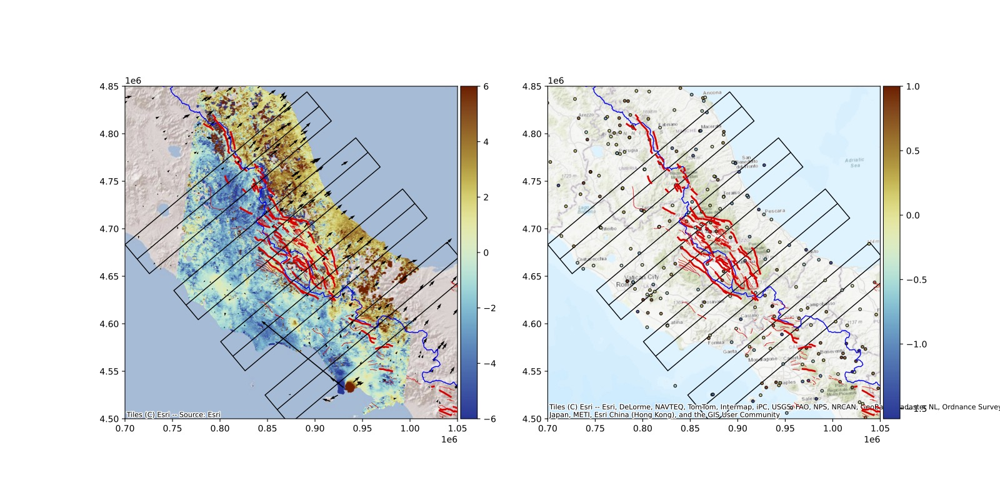
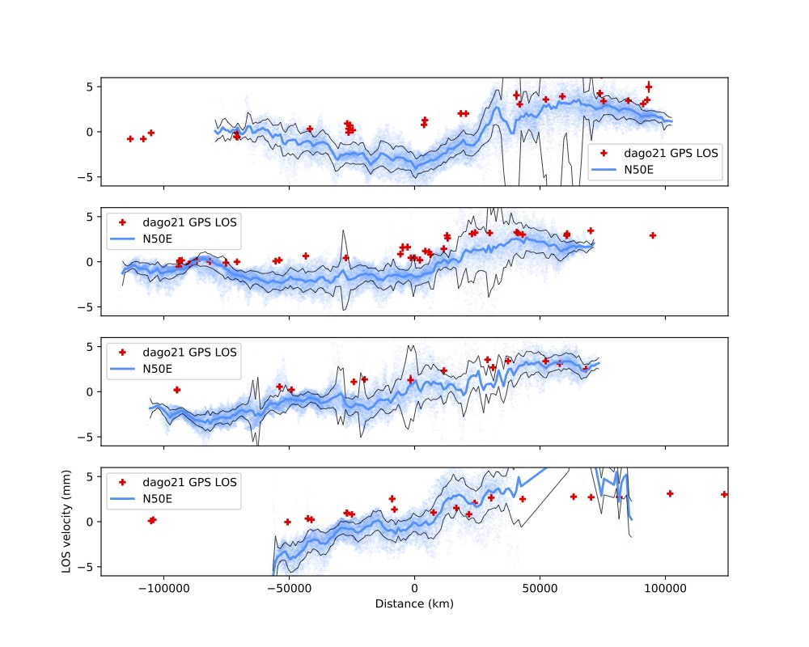
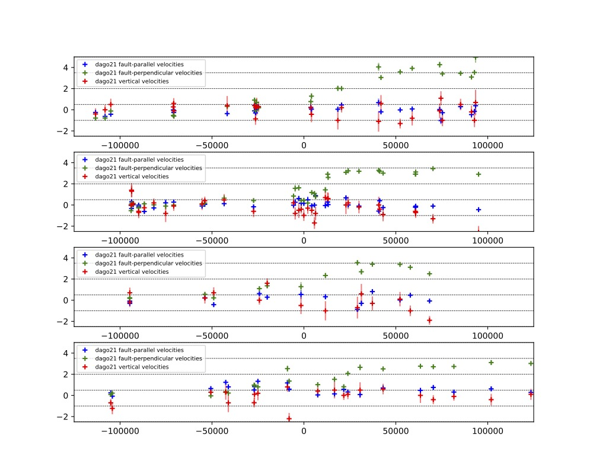
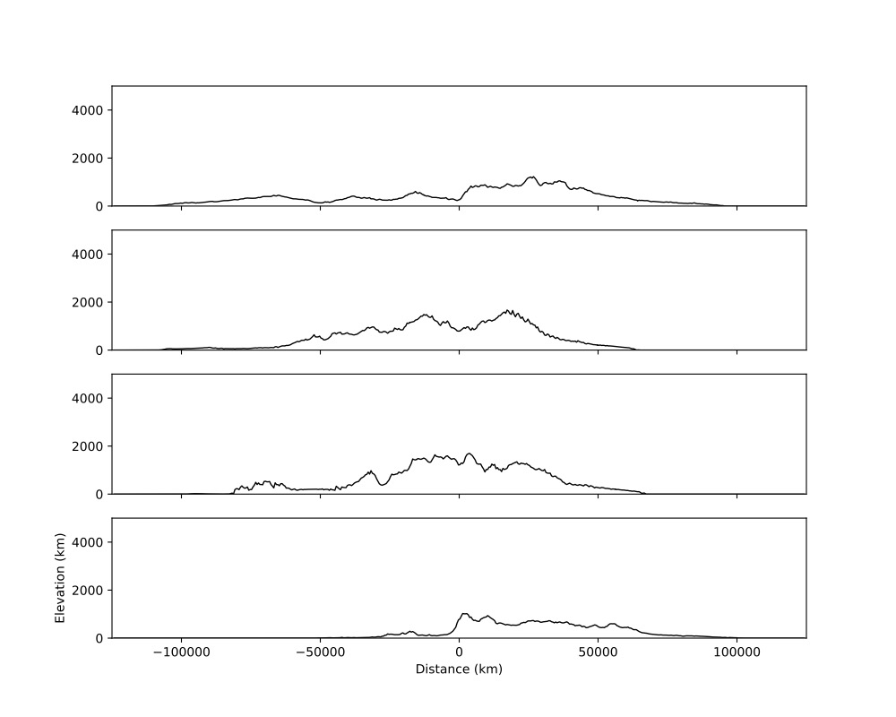
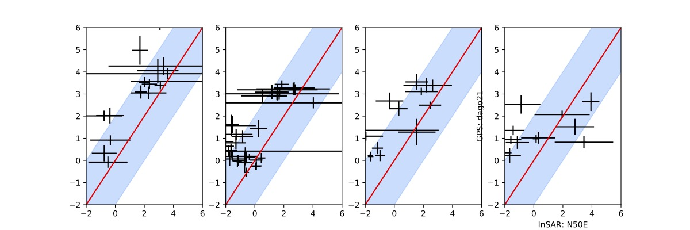

# plotPro.py 

Python script to plot profiles across InSAR and GPS data and estimate residual ramps. 

To perform a profile, you must at least define those two classes: 

Network:
============
    Network class: Load InSAR or GPS data 
    Parameters: 
    network: name input text file
    reduction: reduction name for plot
    wdir: relative path input file
    dim: 1=InSAR, 2,3=GPS
    color: plot option, default: 'black' 
    scale: scale option, default: 1
    theta: load insicence angle in 4th column and project los to average incidence angle
    assuming horizontal displacements, default: False
    samp: subsample option, default:1 
    perc: cleaning outliers option within bins profile, default: percentile=95
    lmin,lmax: min max options for plots

Profile:
============
    profile class: Load profiles 
    Parameters: 
    name: name profile
    x,y: reference point 
    l,w: length, width progile
    strike: strike profile
    type:  std - plot mean and standard deviation InSAR;
    distscale - scatter plot with color scale function of the profile-parallel distance;
    stdscat - plot scatter + standar deviation. 
    flat: if not None estimate a ramp along profile. lin: linear ramp, quad: quadratic, cub: cubic.
    If number InSAR network is 2 then estimate ramp within the overlaping area (Default: None)
    lbins: larger bins for profile
    loc_ramp: location ramp estimation. Can be positive (for postive distances along profile) or negative. Default: None

Optional additional classes:

Topo:
============
    topo class: Load topographic file 
    Parameters: 
    filename: name input file
    name: name file for plot
    wdir: path input file
    scale: scale values
    color
    topomin,topomax
    plotminmax: option to also plot min max topo within bins

Fault2d:
============
    fault2d class: Load 2D fault for plot only
    help to position fault for futher modeling
    Parameters: 
    name: name fault
    x,y: position east, north

Example of INPUT PYTHON FILE:
============

	# Input Parameters
	maindir='../' # root directory 
	outdir=maindir+'output/profiles/norcia-vertical/' # output directory to save files
	xmin, xmax = 7.8e2, 9.1e2 # x/east map extents
	ymin, ymax = 4.7e3, 4.8e3 # y/north map extents
	plot_basemap = True # plot basemap 

	import matplotlib.cm as cm
	cmap = cm.rainbow

	gpsdata=[
        network(network='stations_dago.txt',reduction='dago21',wdir=maindir+'gps/',dim=3,scale=1,utm_proj='32632',lmin=-2.5,lmax=5,proj=[0.766044443118978,0.6427876096865394,0]),
	]

	insardata=[
        network(network='N50E_mmyr.xylos',reduction='T022',wdir=maindir+'/decomposition/8looks/',dim=1,scale=1,utm_proj='32632',color='dodgerblue',lmin=-8,lmax=8),
	]

	profiles=[
         profile(name='Viso',x=8.44e2,y=4.76e3,l=100,w=10,strike=-40,type='stdscat',lbins=1.),
         profile(name='Norcia',x=8.47e2,y=4.75e3,l=100,w=10,strike=-40,type='stdscat',lbins=1.),
         profile(name='Amatrice',x=8.5e2,y=4.74e3,l=100,w=10,strike=-40,type='stdscat',lbins=1.),
        ]

	shapefiles=[
        shapefile(name='Regions',wdir=maindir+'italian-maps-shapefiles/italy-with-regions/',filename='reg2011_g.shp',utm_proj='32632',edgecolor='black',color='none',linewidth=0.5),
        shapefile(name='Main faults',wdir=maindir+'faults/',filename='fault_main_utm32.shp',utm_proj='32632',edgecolor='none',color='red'),
        shapefile(name='Secondary faults',wdir=maindir+'faults/',filename='fault_utm32.shp',utm_proj='32632',edgecolor='none',color='red',linewidth=0.5)
        ]

	topodata=[
        topo(name='DEM_20',wdir=maindir+'DEM_ITALY_20/',filename='DEM20_11.5_15_41.5_43.5_s360.xyz',color='black',width=1.,utm_proj='32632',scale=1,topomin=0, topomax=5000),
        ]

	seismifiles=[
        seismicity(name='INGV 2014-2021', wdir=maindir+'seismicity/',filename='ingv_2014-2021.txt',color='yellow',width=2.,utm_proj='32632',fmt='txt')
	]

	fmodel=[
		fault2d(name='LF',x=8.394e2,y=4.6806e3,utm_proj=None), # add 2D fault in map view
	]

